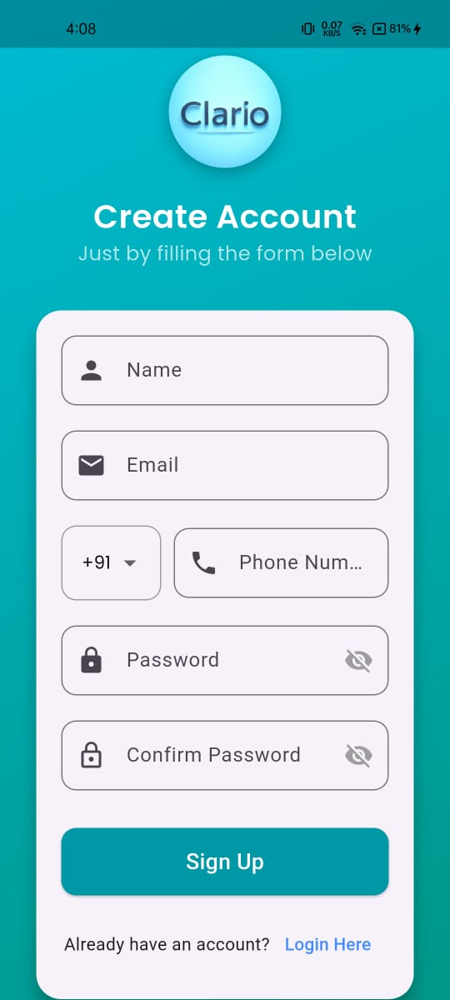
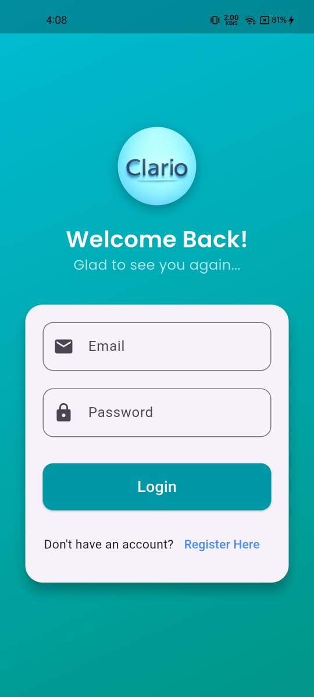
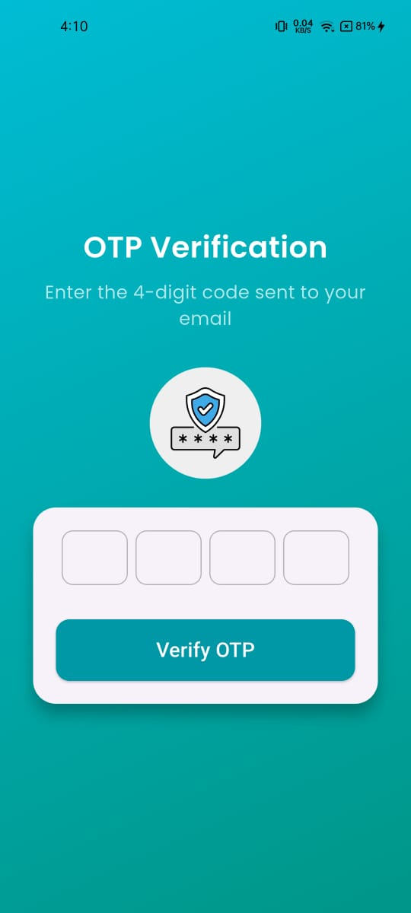
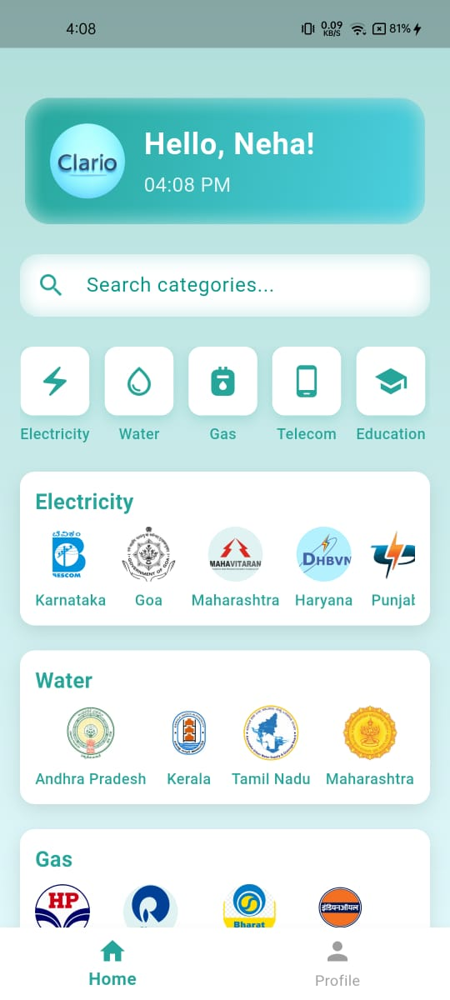
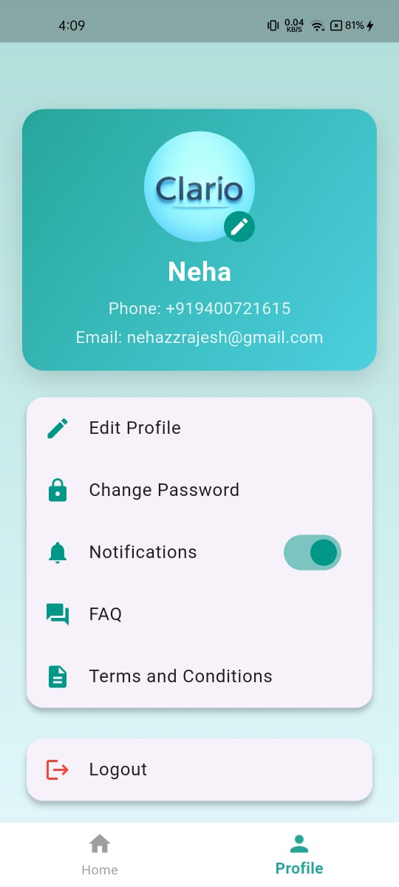
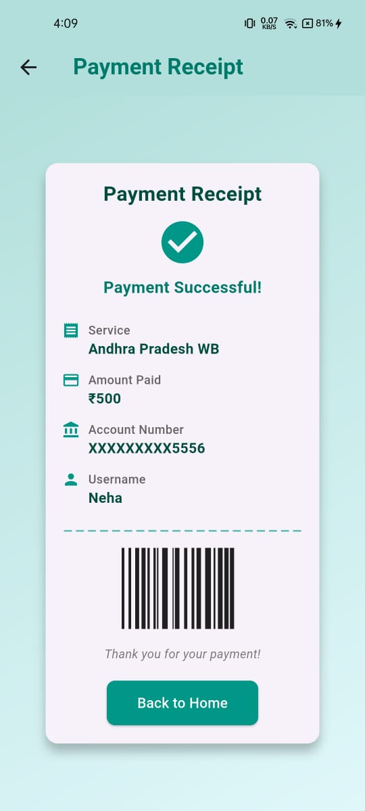
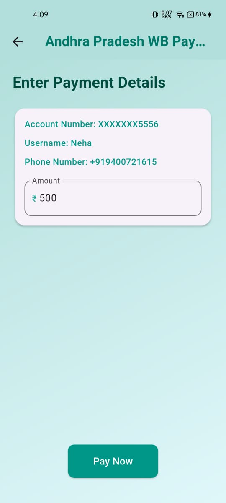
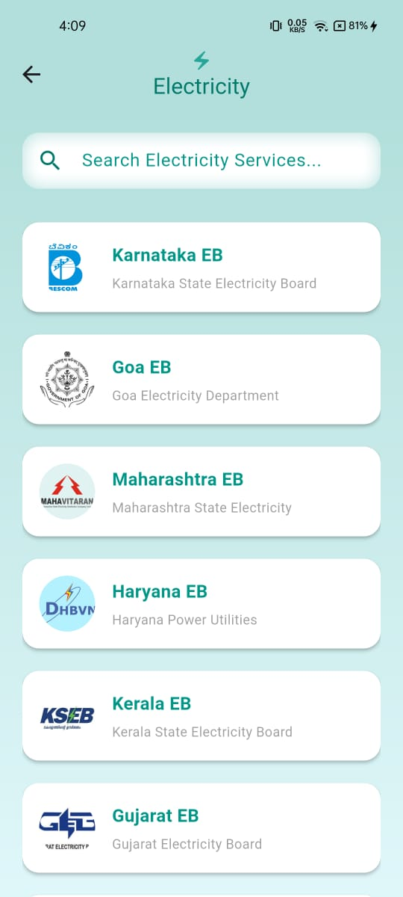

# 📱 Clario – Flutter Utility App

Clario is a **Flutter-based utility services application** developed to **learn and practice core Flutter concepts through real-world features**.

This app simulates common daily utility services like **electricity, water, gas, broadband, telecom, education, insurance, and payments**, helping understand Flutter development by building practical screens instead of simple demos.

It serves as a **hands-on learning project** and a **Flutter experimentation lab**.

---

## 🎯 Project Objective

The goal of this project is to:

- Learn Flutter practically by building real features
- Understand UI design using widgets & layouts
- Implement navigation between multiple screens
- Practice forms, OTP, and confirmation flows
- Structure scalable Flutter apps
- Work with state & async operations

---

## 🚀 Features

### 🧾 Utility Services
- Electricity bill payment
- Water bill payment
- Gas bill payment
- Broadband recharge
- Telecom recharge
- Education fees
- Insurance payments

---

## 📸 Screenshots

### 🔐 Authentication
<p align="center">
  
  
  
</p>

### 🏠 Home & User
<p align="center">
  
  
  
</p>

### 💳 Payments & Utilities
<p align="center">
  
  
</p>


### 👤 User Flow
- Signup screen
- OTP verification
- Payment page
- Confirmation page
- Profile page
- Home dashboard

---

## 🛠 Tech Stack

- Flutter
- Dart
- Material Design
- Android & iOS support

---

## 📂 Project Structure

```

Clario/
│
├── android/            # Android platform files
├── ios/                # iOS platform files
├── assets/             # Images/icons/resources
├── lib/
│   ├── main.dart
│   ├── homepage.dart
│   ├── Signup.dart
│   ├── otp.dart
│   ├── payment.dart
│   ├── confirmation.dart
│   ├── profile.dart
│   │
│   ├── electricity.dart
│   ├── water.dart
│   ├── gas.dart
│   ├── broadband.dart
│   ├── telecom.dart
│   ├── edu.dart
│   └── Insurance.dart
│
├── test/               # Tests
├── pubspec.yaml        # Dependencies
└── README.md

````

---

## ⚙️ Getting Started

### Prerequisites

Install:

- Flutter SDK
- Android Studio / VS Code
- Emulator or physical device

Check setup:

```bash
flutter doctor
````

---

### Clone the Repository

```bash
git clone https://github.com/Curious-Cathy/Clario-App.git
cd Clario-App
```

---

### Install Dependencies

```bash
flutter pub get
```

---

### Run the App

```bash
flutter run
```

---

## 🧪 Testing

```bash
flutter test
```

---

## 📚 Flutter Concepts Practiced

This project demonstrates:

* Stateless & Stateful Widgets
* Navigation & Routes
* Forms & Input fields
* OTP verification flow
* Page transitions
* Reusable components
* Layouts (Row, Column, Grid, Stack)
* Async operations
* Project structuring

---

## 🔮 Future Improvements

* Backend/API integration
* Payment gateway simulation
* Local storage (SharedPreferences)
* State management (Provider/Bloc/Riverpod)
* Dark mode
* UI enhancements
* Better architecture (MVVM/Clean Architecture)

---

## 🤝 Contributions

Suggestions and improvements are welcome!

1. Fork the repo
2. Create a branch
3. Make changes
4. Open a Pull Request

---

## 📜 License

This project is built for educational and learning purposes.

